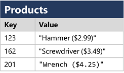
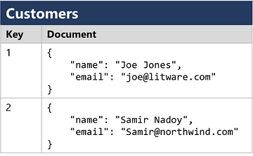

# Explore databases

## Relational databases
- Relational databases are commonly used to store and query structured data.
- The tables are managed and queried using Structured Query Language (SQL).

## Non-relational databases
- Non-relational databases are data management systems that don’t apply a relational schema to the data.
- Non-relational databases are often referred to as NoSQL database.
- 4 common types of Non-relational database commonly in use:
  - **Key-value databases** in which each record consists of a unique key and an associated value, which can be in any format.

    

  - **Document databases**, which are a specific form of key-value database in which the value is a JSON document (which the system is optimized to parse and query)

      

  - Column family databases, which store tabular data comprising rows and columns, but you can divide the columns into groups known as column-families. Each column family holds a set of columns that are logically related together.

    

  - Graph databases, which store entities as nodes with links to define relationships between them.

    