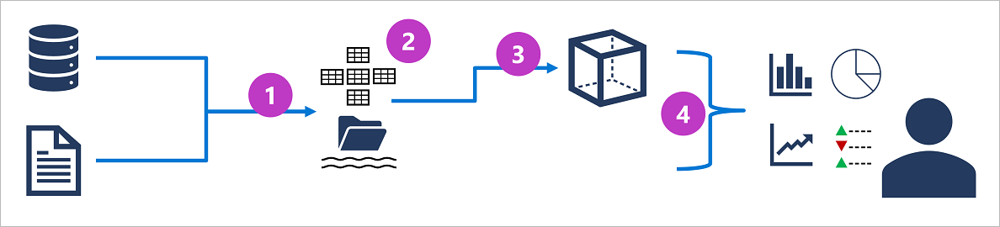

# Explore analytical data processing
> Analytical data processing typically uses read-only (or read-mostly) systems that store vast volumes of historical data or business metrics
>
>

## Step 1
 - Operational data is **extracted**, **transformed**, and **loaded** (**ETL**) into a data lake for analysis.

 ## Step 2
 - Data is loaded into a schema of tables - typically in a Spark-based.

 ## Step 3
 - Data in the data warehouse may be aggregated and loaded into an online analytical processing (OLAP) model, or cube.

 ## Step 4  
 - The data in the data lake, data warehouse, and analytical model can be queried to produce reports, visualizations, and dashboards.

 > *Data lakes* are common in large-scale data analytical processing scenarios, where a large volume of file-based data must be collected and analyzed.
>
> *Data warehouses* are an established way to store data in a relational schema that is optimized for read operations