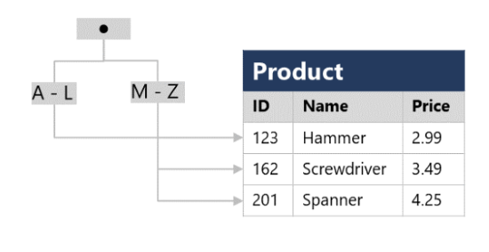

# Describe database objects

> *Views*
>
> *Stored procedures*
>
> *Indexes*

## What is a view?
- A view is a virtual table based on the results of a SELECT query.

```SQL
CREATE VIEW Deliveries
AS
SELECT o.OrderNo, o.OrderDate,
       c.FirstName, c.LastName, c.Address, c.City
FROM Order AS o JOIN Customer AS c
ON o.Customer = c.ID;
```

## What is a stored procedure?
- A stored procedure defines SQL statements that can be run on command.

```SQL
CREATE PROCEDURE RenameProduct
	@ProductID INT,
	@NewName VARCHAR(20)
AS
UPDATE Product
SET Name = @NewName
WHERE ID = @ProductID;
```
```SQL
EXEC RenameProduct 201, 'Spanner';
```

## What is an index?
- An index helps you search for data in a table.
```SQL
CREATE INDEX idx_ProductName
ON Product(Name);
```
